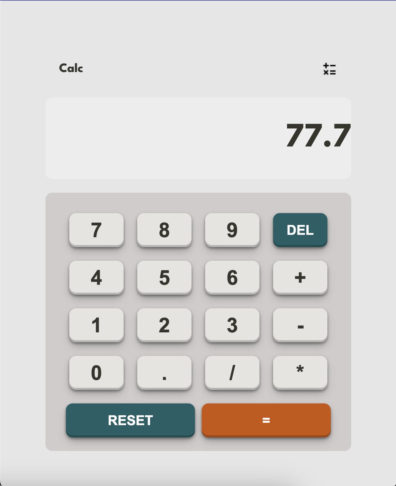

# Welcome 👋



## React Calculator

This is a simple calculator application built using React. It allows users to perform basic arithmetic operations like addition, subtraction, multiplication, and division.

## Demo

You can try out the live demo of the calculator [here](https://mini-easy-react-calculator.netlify.app/).

## Features

- Responsive design that adapts to different screen sizes
- Clear and intuitive user interface
- Supports addition, subtraction, multiplication, and division operations
- Displays both the current calculation and the result
- Handles decimal numbers and negative numbers
- Allows users to perform consecutive calculations

## Installation

1. Clone the repository:

   ```bash
   git clone https://github.com/your-username/react-calculator.git

   ```

2. Navigate to the project directory:
   cd react-calculator
3. Install the dependencies:
   npm install
4. Start the development server:
   npm start
5. Open your browser and visit http://localhost:3000 to see the calculator app.

## Usage

- Enter numbers using the number buttons or the keyboard.
- Use the operation buttons (+, -, \*, /) to perform calculations.
- Press the "=" button or the Enter key to get the result.
- Use the "RESET" button to clear the current calculation.
- Use the "DELETE' button to delete last operation

## Technologies Used

- React
- JavaScript
- HTML
- CSS

## Dependencies

List any external libraries or packages used in your project.

- react
- react-dom
- typescript
- ##Contributing

Contributions are welcome! If you have any suggestions, bug reports, or feature requests, please open an issue or submit a pull request.

## Acknowledgements

Special thanks to the React community for providing excellent documentation and resources

## Contact

For any inquiries or questions, feel free to contact [Mariami] at [gogaladzemariam8@gmail.com].
